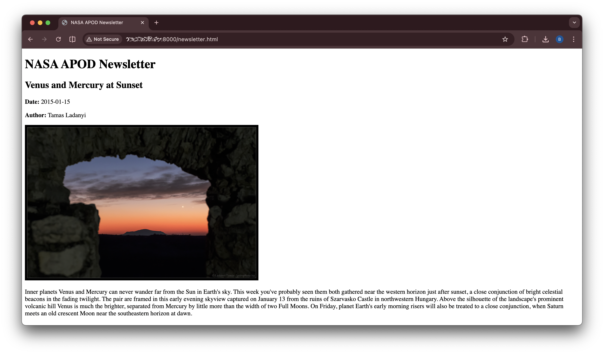

# NASA APOD Newsletter Generator

A Python automation project that pulls random Astronomy Picture of the Day entries from NASA’s APOD API, downloads the images, and generates an HTML newsletter using a Jinja template.

## Preview



## Overview

This project automates the process of building a simple HTML newsletter from live NASA APOD data. The script reads an API key from a file stored outside the project folder, requests random APOD entries, extracts the needed information, downloads the related images, and renders a finished newsletter.

## Features

- Reads a NASA API key from a file outside the project directory
- Connects to NASA’s APOD API
- Requests three random APOD entries
- Filters for image-based entries
- Parses API JSON into a simplified Python data structure
- Downloads full images automatically
- Uses Jinja to generate HTML
- Cleans and rebuilds output folders on each run

## Tech Stack

- Python
- Requests
- Jinja2
- HTML
- CSS
- JSON
- REST API

## Project Structure

```text
nasa_newsletter/
├── .gitignore
├── README.md
├── bin/
│   └── proj02.py
└── templates/
    └── newsletter.html.j2
```

## How It Works

1. The script reads the NASA API key from a file outside the project folder
2. It sends a request to NASA’s APOD API
3. It collects three random image-based APOD entries
4. It extracts the author, date, image name, title, and explanation
5. It downloads the images into the `downloads` folder
6. It renders the newsletter using a Jinja template
7. It writes the final HTML output into the `build` folder

## Requirements

- Python 3
- `requests`
- `Jinja2`

## Installation

Install dependencies:

```bash
python3 -m pip install requests Jinja2
```

If your system blocks `pip`, install the packages using your package manager instead.

Example for Debian or Ubuntu:

```bash
sudo apt update
sudo apt install python3-requests python3-jinja2
```

## API Key Setup

Store your NASA API key in a file outside the project directory.

Example:

```text
/home/yourusername/nasa.key
```

Then make sure the `API_FILE_PATH` variable in `bin/proj02.py` points to that file.

Example:

```python
API_FILE_PATH = Path("/home/yourusername/nasa.key")
```

The script reads the key from that file and removes the trailing newline automatically.

## Usage

From the project root, run:

```bash
python3 bin/proj02.py
```

After the script runs, open:

```text
build/newsletter.html
```

## Output

The script generates:

- `downloads/` for downloaded APOD images
- `build/` for the finished newsletter output
- `build/img/` for copied images used by the newsletter

These folders are generated automatically when the script runs.

## Notes

- The API key file is not included in this repository
- Generated files in `build/` and downloaded files in `downloads/` are not tracked in Git
- The project is written to be reusable and rebuilt as needed

## Why I Built This

I built this project to practice Python automation, API integration, JSON parsing, file handling, and HTML generation with Jinja templates. It reflects the kind of scripting and workflow automation used in real IT, support, and operations environments.

## Future Improvements

- Add stronger error handling for API failures
- Support date ranges instead of only random entries
- Improve the newsletter styling
- Add logging for build steps
- Make output configurable through command-line arguments
